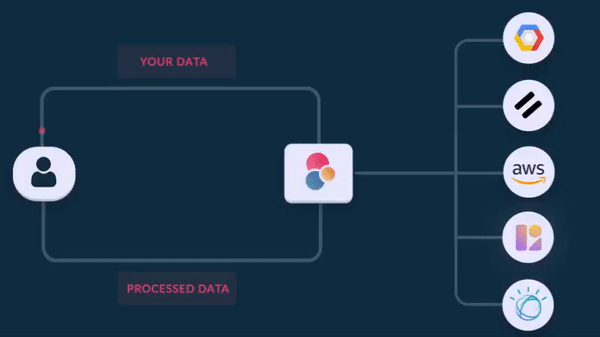

[](https://opensource.org/licenses/Apache-2.0) [](https://github.com/edenai/edenai-apis/actions/workflows/test.yml)


<!-- markdown-toc start - Don't edit this section. Run M-x markdown-toc-refresh-toc -->
**Table of Contents**

- [EdenAI APIs](#edenai-apis)
    - [Package Installation](#package-installation)
    - [Quick Start](#quick-start)
        - [Asynchronous features](#asynchronous-features)
    - [Contribute](#contribute)
    - [Don’t want to create accounts for all providers and host the project by yourself?](#dont-want-to-create-accounts-for-all-providers-and-host-the-project-by-yourself)
    - [Join the community!](#join-the-community)
    - [License](#license)

<!-- markdown-toc end -->
# EdenAI APIs

[Eden AI](https://www.edenai.co/?referral=github) aims to simplify the use and deployment of AI technologies by providing a unique API (application programming interface) that connects to the best possible AI engines. These engines are either proprietary or Open source AI engines, and can be used for different purposes, e.g, face
detection, OCR (receipt, invoice, table...), keyword extraction, sentiment analysis, face detection, and much more. These technologies are provided by the best suppliers in the market. We can cite briefly some of them: Amazon, Google, Microsoft, Dataleon, and Mindee and many others. Eden AI take care of providing to it’s clients the best AI engine suited to their projects, and this, with the goal of keeping AI light and easy to any developer. 



## Package Installation

You can install the package with pip :
``` bash
pip install https://github.com/edenai/edenai-apis 
```

## Quick Start

Eden AI APIs is the open source package including necessary methods for using AI technologies from different AI providers (ex: google, amazon, clarifai .etc).

First add the api-keys/secrets for the provider you will use in `edenai_apis.api_keys.<provider_name>_settings_templates.json`, then rename the file to `<provider_name>_settings.json`
  
When it's done you can directly start using edenai_apis.
Here is a quick example using Google and IBM Keyword Extraction apis:
```python
from edenai_apis import Text

keyword_extraction = Text.keyword_extraction("microsoft")
microsoft_res = keyword_extraction(language="en", text="as simple as that")

# Provider's response
print(microsoft_res.original_response)

# Standardized version of Provider's response
print(microsoft_res.standardized_response)

for item in microsoft_res.standardized_response.items:
    print(f"keyword: {item.keyword}, importance: {item.importance}")


# What if we want to try an other provider?
ibm_kw = Text.keyword_extraction("ibm")
ibm_res = ibm(language="en", text="same api & unified inputs for all providers")


# `original_response` will obviously be different and you will have to check
# the doc of each individual providers to know how to parse them
print(ibm_res.original_response)

# We can however easily parse `standardized_response`
# the same way as we did for microsoft:
for item in ibm_res.standardized_response.items:
    print(f"keyword: {item.keyword}, importance: {item.importance}")
```

### Asynchronous features

If you're need to use features like _speech to text_, _object extraction_ from videos, etc. Then you will need to use asynchrounous operations. This means that will first make a call to launch an asynchrounous job, it will return a job ID allowing you to make other calls to get the job status or response if the job is finished

```python
from edenai_apis import Audio

stt_launch = Audio.speech_to_text_async__launch_job("google")
res = stt_launch(
    file=your_file.wav,
    language="en",
    speakers=2,
    profanity_filter=False,
)

job_id = stt_launch.provider_job_id

stt_get_result = Audio.speech_to_text_async__get_job_result("google")
res = stt_get_result(provider_job_id=job_id)
print(res.status)  # "pending" | "succeeded" | "failed"
```

## Available Features & Providers
You can find a list of all available features and providers [here](AVAILABLES_FEATURES_AND_PROVIDERS.md)

## Contribute

We would love to have your contribution. Please follow our [gidelines for adding a new AI provider's API or a new AI feature](CONTRIBUTE.md). You can check [the package structure](PACKAGE_STRUCTURE.md) for more details on how it is organized.
We use GitHub issues for tracking requests and bugs. For broader discussions you can [join our discord](https://discord.com/invite/VYwTbMQc8u).

## Don’t want to create accounts for all providers and host the project by yourself?
You can create an account on [Eden AI](https://app.edenai.run/user/register?referral=github) and have access to all the AI technologies and providers directly through our API.
[](https://app.edenai.run/user/register?referral=github)


## Join the community!
Join our friendly community to improve your skills, focus on the integration of AI engines, get help to use Eden AI API and much more !

[](https://discord.com/invite/VYwTbMQc8u)
[](https://www.linkedin.com/company/edenai/) [](https://edenai.medium.com/)

## License
[Apache License 2.0](LICENSE)
<details><summary>affinda</summary>
